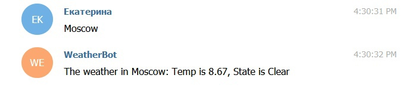

# Weather bot
Телеграмм бот, который показывает погоду в городе, который ты выберешь. Пример работы телеграмм бота:



## How install
Добавить в `const.py`:
```python
TOKEN = 'your token'
...
MY_ID = 'your id'
...
WEATHER_TOKEN = 'your token'
```

Затем установи библитеку `requests`:

```bash
pip install requests
```
